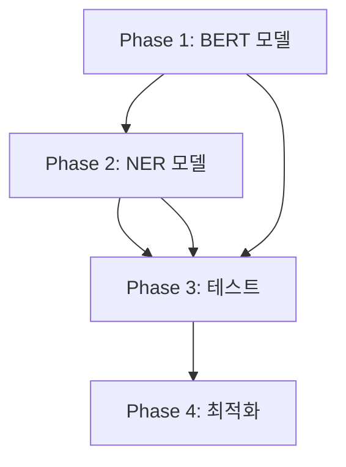

# SPEC-AI-002: 구현 계획

## 개요

본 문서는 SPEC-AI-002의 구현 계획, 마일스톤, 기술적 접근 방식을 설명합니다.

## 구현 마일스톤

### Phase 1: BERT 모델 통합 (주요 목표)

**목표**: KcBERT 기반 의도 분류 모델을 TensorFlow Lite로 통합

#### 작업 항목

1. **모델 준비**
   - [ ] KcBERT 모델 다운로드 (Hugging Face)
   - [ ] TFLite 변환 스크립트 작성
   - [ ] 양자화 적용 (FP32 → INT8)
   - [ ] 모델 파일 앱 번들에 추가

2. **토크나이저 통합**
   - [ ] WordPiece 토크나이저 JavaScript 구현
   - [ ] 특수 토큰 처리 ([CLS], [SEP], [PAD])
   - [ ] 입력 길이 제한 구현 (128 토큰)

3. **TFLite 서비스 구현**
   - [ ] TFLite 모델 로딩 클래스 작성
   - [ ] GPU 대리자 초기화 (Android)
   - [ ] 입력 텐서 준비 로직
   - [ ] 출력 텐서 해석 로직

4. **IntentClassifier 리팩토링**
   - [ ] Mock inference → 실제 TFLite 추론
   - [ ] 폴백 메커니즘 유지
   - [ ] 에러 처리 개선

#### 기술적 고려사항
- **모델 변환**: TensorFlow 2.x + TFLite Converter
- **토크나이저**: transformers.js 또는 순수 JS 구현
- **성능**: 첫 추론 로딩 시간 최소화

### Phase 2: NER 모델 통합 (주요 목표)

**목표**: KoBERT-NER 기반 개체명 인식 모델 통합

#### 작업 항목

1. **모델 준비**
   - [ ] KoBERT-NER 모델 다운로드
   - [ ] TFLite 변환 및 양자화
   - [ ] 태그 매핑 테이블 작성

2. **엔티티 추출 파이프라인**
   - [ ] NER 추론 로직 구현
   - [ ] BIO 태그 → 엔티티 변환
   - [ ] 엔티티 병합 로직 (동일 태그 연속)

3. **EntityExtractor 리팩토링**
   - [ ] NER 모델 통합
   - [ ] 정규식 폴백 유지
   - [ ] 한국어 이름 패턴 개선

#### 기술적 고려사항
- **태그 해석**: BIO 체계 (B-PER, I-PER, O)
- **엔티티 병합**: 연속된 동일 태그 병합
- **타입 변환**: NER 태그 → Momentum 엔티티 타입

### Phase 3: 테스트 작성 (최종 목표)

**목표**: 60% → 80% 테스트 커버리지 달성

#### 작업 항목

1. **Unit Tests**
   - [ ] TFLiteService 테스트
   - [ ] Tokenizer 테스트
   - [ ] IntentClassifier 테스트 (실제 모델)
   - [ ] EntityExtractor 테스트 (실제 모델)

2. **Integration Tests**
   - [ ] OCR → Intent → Entity 파이프라인
   - [ ] 폴백 메커니즘 테스트
   - [ ] 에러 처리 테스트

3. **Performance Tests**
   - [ ] 추론 속도 벤치마크
   - [ ] 메모리 사용량 측정
   - [ ] 배터리 소모 측정

4. **Privacy Tests**
   - [ ] 네트워크 전송 검증
   - [ ] 로컬 처리 검증

### Phase 4: 성능 최적화 (선택적 목표)

**목표**: 배터리 효율 및 추론 속도 개선

#### 작업 항목

1. **GPU 가속**
   - [ ] Android GPU Delegate 통합
   - [ ] iOS Metal Delegate 통합

2. **모델 최적화**
   - [ ] 양자화 최적화 (INT8)
   - [ ] 모델 프루닝 (선택적)

3. **캐싱 전략**
   - [ ] 추론 결과 캐싱
   - [ ] 모델 캐싱

## 기술적 접근 방식

### 아키텍처

```
┌─────────────────────────────────────────────────────────────┐
│                    Context Input                             │
│                  (Screenshot/Chat)                           │
└───────────────────────┬─────────────────────────────────────┘
                        │
                        ▼
┌─────────────────────────────────────────────────────────────┐
│                    OCR Service                               │
│              (Google ML Kit - 완료)                          │
└───────────────────────┬─────────────────────────────────────┘
                        │
                        ▼
┌─────────────────────────────────────────────────────────────┐
│                  TFLite Service                              │
│  ┌───────────────────────────────────────────────────────┐  │
│  │  IntentClassifier (KcBERT-TFLite)                     │  │
│  │  - Input: Text (max 128 tokens)                       │  │
│  │  - Output: Intent probabilities (5 classes)           │  │
│  │  - Fallback: Keyword matching                         │  │
│  └───────────────────────────────────────────────────────┘  │
│  ┌───────────────────────────────────────────────────────┐  │
│  │  EntityExtractor (KoBERT-NER-TFLite)                  │  │
│  │  - Input: Text (max 256 tokens)                       │  │
│  │  - Output: BIO tags → Entities                       │  │
│  │  - Fallback: Regex patterns                           │  │
│  └───────────────────────────────────────────────────────┘  │
└───────────────────────┬─────────────────────────────────────┘
                        │
                        ▼
┌─────────────────────────────────────────────────────────────┐
│                Context Analyzer Service                      │
│              (Action Suggestion)                            │
└─────────────────────────────────────────────────────────────┘
```

### 의존성 관계



### 위험 완화 계획

| 위험 | 확률 | 영향 | 완화 전략 |
|------|------|------|-----------|
| TFLite 변환 실패 | 중 | 높 | 대안 모델 (MobileBERT) 고려 |
| 성능 목표 미달 | 중 | 중 | GPU 가속, 양자화 강화 |
| 앱 번들 크기 초과 | 낮 | 중 | 모델 다운로드 (on-demand) 고려 |
| 한국어 토크나이저 문제 | 낮 | 높 | 사전 토크나이저 사용 |

## 구현 우선순위

### Priority High (필수)
1. BERT 모델 TFLite 변환
2. TFLite 로딩 서비스 구현
3. IntentClassifier 실제 추론 통합

### Priority Medium (중요)
1. NER 모델 TFLite 변환
2. EntityExtractor 실제 추론 통합
3. 기본 Unit Tests 작성

### Priority Low (선택적)
1. GPU 가속
2. 모델 양자화 최적화
3. 성능 벤치마킹

## 검증 기준

### 완료 정의 (Definition of Done)

각 Phase는 다음 조건을 만족해야 완료로 간주됩니다:

**Phase 1 완료 기준**:
- [ ] TFLite 모델 파일이 앱 번들에 포함
- [ ] IntentClassifier가 실제 추론 수행
- [ ] 평균 추론 속도 <500ms
- [ ] 테스트 커버리지 >50%

**Phase 2 완료 기준**:
- [ ] NER 모델 파일이 앱 번들에 포함
- [ ] EntityExtractor가 실제 추론 수행
- [ ] 평균 추론 속도 <300ms
- [ ] 테스트 커버리지 >60%

**Phase 3 완료 기준**:
- [ ] 전체 테스트 커버리지 >80%
- [ ] 모든 테스트 통과
- [ ] 성능 테스트 완료

**Phase 4 완료 기준**:
- [ ] 배터리 소모 <5% 확인
- [ ] GPU 가속 작동 확인
- [ ] 앱 번들 크기 증가 <150MB

## 다음 단계

1. **모델 변환 환경 설정**: Python + TensorFlow 2.x
2. **KcBERT 모델 다운로드**: Hugging Face에서 모델 확보
3. **TFLite 변환 스크립트 작성**: 변환 파이프라인 구현
4. **Phase 1 시작**: 모델 통합

---

**버전**: 1.0.0
**마지막 업데이트**: 2026-01-18
**작성자**: Spec Builder Agent
