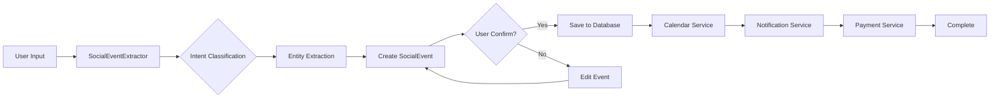

# Social Event Management Feature

## Overview

The Social Event Management feature is the first implemented use case of Momentum. It automatically extracts social event information from user input (text, screenshots, chat messages) and provides actionable assistance including calendar integration, reminders, and payment preparation.

**SPEC**: [SPEC-SOC-001](../.moai/specs/SPEC-SOC-001/spec.md)

---

## Table of Contents

1. [Features](#features)
2. [Architecture](#architecture)
3. [User Flow](#user-flow)
4. [Components](#components)
5. [Services](#services)
6. [Data Models](#data-models)
7. [Integration](#integration)
8. [Testing](#testing)

---

## Features

### 1. Event Type Detection

The system automatically identifies social event types from various inputs:

| Event Type | Keywords (EN) | Keywords (KO) |
|------------|---------------|---------------|
| **Wedding** | wedding, marriage | 결혼, 결혼식, 예식, 웨딩 |
| **Funeral** | funeral | 장례, 장례식, 빈소, 상가 |
| **First Birthday** | first birthday | 돌, 돌잔치, 첫생일 |
| **60th Birthday** | 60th birthday | 환갑, 회갑, 칠순, 팔순 |
| **Birthday** | birthday, party | 생일, 생신, 파티 |
| **Graduation** | graduation | 졸업, 졸업식 |

### 2. Information Extraction

Automatically extracts:
- **Date & Time**: Event date and time (supports relative dates like "next week")
- **Location**: Venue name and address
- **Contact**: Related person's name and phone number
- **Relationship**: Type of relationship (family, friend, colleague, etc.)
- **Gift Amount**: Suggested gift amount based on relationship

### 3. Calendar Integration

- Automatic event registration to device calendar (iOS/Android)
- Custom event titles: "[EventType] Person Name Event"
- Smart reminders: D-7, D-1, and morning of event
- Event synchronization when details change

### 4. Payment Preparation

- Deep links to major payment apps (KakaoPay, Toss, NaverPay)
- Relationship-based recommended amounts
- Payment tracking (sent/pending status)

---

## Architecture

### Module Structure

```
src/features/social/
├── components/
│   ├── SocialEventCard.tsx       # Event display card
│   ├── SocialEventList.tsx       # Event list view
│   └── index.ts
├── screens/
│   └── (Future: Event detail screens)
└── services/
    └── (Refer to services section)

src/services/
├── socialEvent/
│   ├── SocialEventExtractor.ts    # AI-based extraction
│   └── index.ts
├── calendar/
│   ├── CalendarService.ts         # Calendar integration
│   └── index.ts
├── payment/
│   ├── PaymentDeepLinkService.ts  # Payment links
│   └── index.ts
└── database/
    ├── SocialEventDAO.ts          # Data access
    ├── SocialEvent.schema.ts      # DB schema
    └── index.ts

src/shared/models/
├── SocialEvent.types.ts           # Type definitions
└── index.ts

src/store/
└── socialEventStore.ts            # Zustand store
```

### Data Flow



---

## User Flow

### Scenario 1: Wedding Event from Chat

```
Input: "다음 달 15일 오후 2시에 결혼식이 있어요.
       그랜드 웨딩홀 서울점에서 진행합니다."
  ↓
[1] Intent Classification: "wedding" (confidence: 0.9)
[2] Entity Extraction:
    - Date: Next month 15th, 2:00 PM
    - Location: 그랜드 웨딩홀 서울점
  ↓
[3] User Confirmation:
    Show extracted information for approval
  ↓
[4] Calendar Registration:
    - Title: "결혼식"
    - Date: [Extracted Date]
    - Location: 그랜드 웨딩홀 서울점
    - Reminders: D-7, D-1, 9 AM day-of
  ↓
[5] Complete:
    Event saved, calendar synced, reminders scheduled
```

### Scenario 2: Funeral Event with Payment

```
Input: "장례식이 내일 오전 10시에 있어요.
       평화장례식장이고 친구 관계예요."
  ↓
[1] Intent Classification: "funeral" (confidence: 1.0)
[2] Priority Inference: "urgent" (tomorrow)
[3] Entity Extraction:
    - Date: Tomorrow, 10:00 AM
    - Location: 평화장례식장
    - Relationship: friend
  ↓
[4] Recommended Amount:
    Base: 50,000 KRW (funeral)
    Multiplier: 1.0 (friend)
    → Recommended: 50,000 KRW
  ↓
[5] Payment Links:
    - KakaoPay: kakaopay://...
    - Toss: supertoss://...
    - NaverPay: naverpay://...
  ↓
[6] Complete:
    Event saved, urgent reminder set, payment links ready
```

---

## Components

### SocialEventCard

Display component for a single social event.

```typescript
interface SocialEventCardProps {
  event: SocialEvent;
  onPress?: (event: SocialEvent) => void;
  onEdit?: (event: SocialEvent) => void;
  onDelete?: (eventId: string) => void;
}
```

**Features:**
- Event type badge with color coding
- Event title and description
- Countdown display (days until event)
- Location and contact display
- Gift status indicator
- Action buttons (Edit, Delete, Pay)

### SocialEventList

List view for all social events.

```typescript
interface SocialEventListProps {
  filter?: SocialEventFilter;
  onEventPress?: (event: SocialEvent) => void;
}
```

**Features:**
- Sortable by date, priority, type
- Filter by status, type, gift sent status
- Empty state with helpful message
- Pull to refresh
- Infinite scroll (pagination)

---

## Services

### SocialEventExtractor

Extracts social event information from text input.

```typescript
class SocialEventExtractor {
  classifyIntent(text: string): IntentResult;
  extractEntities(text: string): ExtractedEntities;
  inferPriority(text: string): SocialEventPriority;
  extract(text: string): ExtractionResult;
}
```

**Supported Extractions:**
- Dates: "2025-01-15", "1월 15일", "내일", "다음 주 금요일"
- Times: "오후 2시", "오전 10시"
- Phone: "010-1234-5678"
- Amounts: "5만 원", "50,000원", "오만원"
- Locations: "웨딩홀", "장례식장", 복합 장소명

### CalendarService

Manages device calendar integration.

```typescript
class CalendarService {
  requestPermissions(): Promise<boolean>;
  addEvent(event: SocialEvent): Promise<string | null>;
  updateEvent(calendarId: string, event: SocialEvent): Promise<string | null>;
  removeEvent(calendarId: string): Promise<boolean>;
  syncEvent(event: SocialEvent): Promise<string | null>;
}
```

**Features:**
- Cross-platform support (iOS EventKit, Android Calendar)
- Permission management
- Automatic reminder creation
- Event synchronization

### PaymentDeepLinkService

Creates payment app deep links.

```typescript
class PaymentDeepLinkService {
  createKakaoPayLink(receiver: PaymentReceiver): string;
  createTossLink(receiver: PaymentReceiver): string;
  createNaverPayLink(receiver: PaymentReceiver): string;
  getRecommendedAmount(options: RecommendationOptions): number;
  createPaymentLinks(options: PaymentOptions): PaymentLinks;
}
```

**Recommended Amounts by Relationship:**

| Relationship | Wedding | Funeral | Birthday |
|--------------|---------|---------|----------|
| Family | 150,000 | 50,000-100,000 | 50,000+ |
| Relative | 120,000 | 50,000 | 50,000 |
| Friend | 100,000 | 50,000 | 30,000 |
| Colleague | 120,000 | 50,000 | 30,000 |
| Boss | 150,000 | 100,000 | 50,000 |

---

## Data Models

### SocialEvent

```typescript
interface SocialEvent {
  id: string;
  type: SocialEventType;
  status: SocialEventStatus;
  priority: SocialEventPriority;
  title: string;
  description: string | null;
  eventDate: Date;
  location: SocialEventLocation | null;
  contact: SocialEventContact | null;
  giftAmount: number | null;
  giftSent: boolean;
  giftSentDate: Date | null;
  reminderSet: boolean;
  reminderDate: Date | null;
  calendarEventId: string | null;
  notes: string | null;
  createdAt: Date;
  updatedAt: Date;
}
```

### Database Schema

```sql
CREATE TABLE social_events (
  id TEXT PRIMARY KEY,
  type TEXT NOT NULL,
  status TEXT NOT NULL,
  priority TEXT NOT NULL,
  title TEXT NOT NULL,
  description TEXT,
  event_date INTEGER NOT NULL,
  location_json TEXT,
  contact_json TEXT,
  gift_amount INTEGER,
  gift_sent INTEGER DEFAULT 0,
  gift_sent_date INTEGER,
  reminder_set INTEGER DEFAULT 0,
  reminder_date INTEGER,
  calendar_event_id TEXT,
  notes TEXT,
  created_at INTEGER NOT NULL,
  updated_at INTEGER NOT NULL
);

CREATE INDEX idx_social_events_date ON social_events(event_date);
CREATE INDEX idx_social_events_type ON social_events(type);
CREATE INDEX idx_social_events_status ON social_events(status);
```

---

## Integration

### Calendar Integration

Uses `react-native-calendar-events` for cross-platform calendar access.

**iOS**: EventKit Framework
**Android**: Calendar Provider

### Payment App Integration

Deep link schemes:

| App | Scheme | Example |
|-----|--------|---------|
| KakaoPay | `kakaopay://` | `kakaopay://pay?amount=50000` |
| Toss | `supertoss://` | `supertoss://transfer?amount=50000` |
| NaverPay | `naverpay://` | `naverpay://pay?amount=50000` |

---

## Testing

### Unit Tests

- `SocialEventExtractor.test.ts`: Intent classification and entity extraction
- `PaymentDeepLinkService.test.ts`: Payment link generation
- `CalendarService.test.ts`: Calendar integration (mocked)
- `SocialEvent.types.test.ts`: Type validation

### Integration Tests

- End-to-end event creation flow
- Calendar sync verification
- Payment link validation

### Test Coverage

Target: **85%+** coverage for all services.

---

## Future Enhancements

### Phase 2 Features (Planned)

- [ ] Image OCR extraction (invitation cards)
- [ ] Contact matching and auto-fill
- [ ] Map integration for directions
- [ ] Gift history tracking
- [ ] Multi-event support (group events)
- [ ] Statistics and insights dashboard

### AI Model Integration (SPEC-AI-002)

- Replace keyword-based classification with TensorFlow Lite
- Improve entity extraction accuracy
- Support more complex date expressions
- Context-aware relationship inference

---

**Last Updated**: 2026-01-18
**Version**: 1.0.0
**Status**: ✅ Completed
